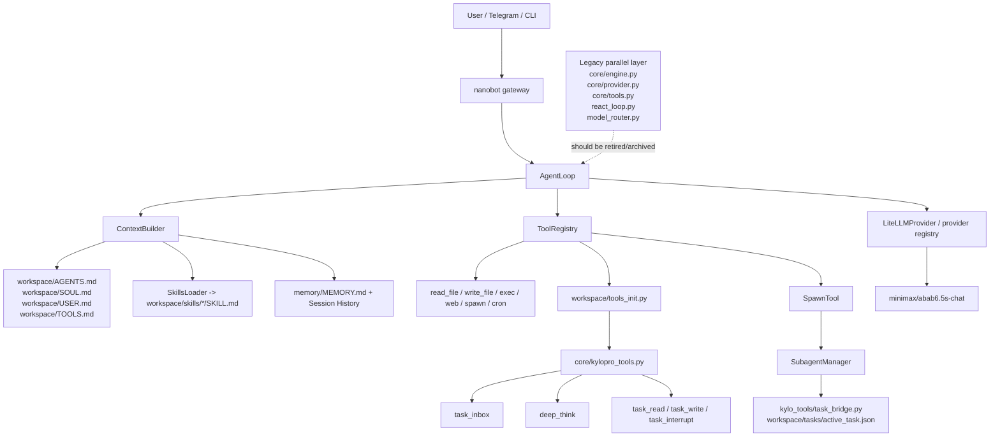

# Kylopro-Nexus 架构审查与清理计划

> 日期：2026-03-07
> 目的：确认当前真实运行架构、识别仍会误导或分裂运行时的部分，并给出下一阶段按模块拆分的清理/开发计划。

## 1. Review Findings

### Critical

1. `core/engine.py` 仍保留完整的平行运行时入口，会重新实例化旧 `KyloproProvider` 并手动注册另一套工具链。
   - 位置：[core/engine.py](c:\Users\qianchen\Desktop\nanobot\Kylopro-Nexus\core\engine.py#L37), [core/engine.py](c:\Users\qianchen\Desktop\nanobot\Kylopro-Nexus\core\engine.py#L113), [core/engine.py](c:\Users\qianchen\Desktop\nanobot\Kylopro-Nexus\core\engine.py#L143)
   - 风险：任何人只要手工跑 `python -m core.engine`，就会重新回到“外层包装 + 平行工具系统”的旧架构，继续制造双脑问题。

2. `core/provider.py` 仍是一套自研多脑路由层，与 nanobot 原生 provider/config 体系并行存在。
   - 位置：[core/provider.py](c:\Users\qianchen\Desktop\nanobot\Kylopro-Nexus\core\provider.py#L169), [core/provider.py](c:\Users\qianchen\Desktop\nanobot\Kylopro-Nexus\core\provider.py#L345), [core/provider.py](c:\Users\qianchen\Desktop\nanobot\Kylopro-Nexus\core\provider.py#L947)
   - 风险：即使生产 bat 已切到 `nanobot gateway`，只要旧入口或旧脚本还在被使用，这套 provider 仍会把模型选择、env 读取、tool calling 行为拉回另一条链路。

### High

3. `core/tools.py` 与 `core/kylopro_tools.py` 同时承担“把能力包装成 Tool”的职责，但属于两条不同世代的集成思路。
   - 位置：[core/tools.py](c:\Users\qianchen\Desktop\nanobot\Kylopro-Nexus\core\tools.py), [core/kylopro_tools.py](c:\Users\qianchen\Desktop\nanobot\Kylopro-Nexus\core\kylopro_tools.py#L300)
   - 风险：后续如果继续在两处同时加工具，名称冲突、能力漂移和行为不一致几乎是必然的。

4. 生产链路已经切到 `workspace/` + `tools_init.py`，但旧 `skills/*.py` 实验资产依然大量存在，没有做“保留 / 迁移 / 归档”分类。
   - 位置：[workspace/tools_init.py](c:\Users\qianchen\Desktop\nanobot\Kylopro-Nexus\workspace\tools_init.py), [nanobot/agent/skills.py](c:\Users\qianchen\Desktop\nanobot\nanobot\agent\skills.py#L13)
   - 风险：团队后续容易把 `SKILL.md`、附属 Python、旧 skill.py、Tool 实现继续混在一起开发。

### Medium

5. 当前启动面已经比之前稳定，但“正确入口”知识仍分散在 bat、DEVLOG、任务文件里，缺一份面向本地运行者的单页说明。
   - 位置：[start_gateway.bat](c:\Users\qianchen\Desktop\nanobot\Kylopro-Nexus\start_gateway.bat), [start_production.bat](c:\Users\qianchen\Desktop\nanobot\Kylopro-Nexus\start_production.bat), [setup.bat](c:\Users\qianchen\Desktop\nanobot\Kylopro-Nexus\setup.bat)
   - 风险：使用者仍可能从历史印象出发，手工执行旧入口。

## 2. 当前真实架构

### 核心结论

- 真正的生产内核是 nanobot，不是 `core/engine.py`
- 真正的运行循环是 `AgentLoop`
- 真正的上下文装配入口是 `ContextBuilder`
- 真正的技能入口是 `workspace/skills/*/SKILL.md`
- Kylopro 当前有效的 Python 扩展入口是 `workspace/tools_init.py` -> `core/kylopro_tools.py`
- 后台长任务与中断基础设施已经落在 `TaskBridge + SubagentManager`

### 架构图

## 3. 各部分如何协作

### A. 入口层

- `start_gateway.bat`
- `start_production.bat`
- `clean_restart_gateway.bat`

职责：只允许通过外层 nanobot 源码环境启动 `nanobot gateway`，并避免重复或串环境启动。

### B. nanobot 运行时内核

- `nanobot/agent/loop.py`
- `nanobot/agent/context.py`
- `nanobot/agent/skills.py`
- `nanobot/agent/subagent.py`

职责：负责主会话循环、上下文组装、技能摘要加载、长任务 spawn 和后台任务执行。

### C. Kylopro 工作区规则层

- `workspace/AGENTS.md`
- `workspace/SOUL.md`
- `workspace/USER.md`
- `workspace/skills/*/SKILL.md`

职责：定义人格、开发规则、技能触发词、任务流和边界约束。

### D. Kylopro Python 扩展层

- `workspace/tools_init.py`
- `core/kylopro_tools.py`
- `kylo_tools/task_bridge.py`

职责：把 Kylopro 仍然需要的专用能力接回 nanobot 原生 ToolRegistry。

### E. 历史平行实现层

- `core/engine.py`
- `core/provider.py`
- `core/tools.py`
- `core/react_loop.py`
- `core/model_router.py`
- `core/tool_registry.py`
- 若干 `skills/*.py` 实验实现

职责：现在主要是历史资产和迁移参考，不应继续作为生产主链路。

## 4. 已执行清理

- 已删除明显的临时 / 备份残留：
  - `core/provider.py.backup`
  - `core/provider.py.backup_20260307_1809`
- 已新增强制清理重启脚本：
  - `clean_restart_gateway.bat`

## 5. 下一阶段任务按模块拆分

### P2. 向量记忆规范

清理对象：
- `skills/vector_memory/` 的旧实验思路
- `memory/` 下未来接口与 nanobot 原生 memory 的边界

开发对象：
- `memory/memory_manager.py` CLI 规范
- `workspace/skills/kylo-memory/SKILL.md`
- `task`/`docs` 中的标签和调用约定

### P3. Antigravity MCP-first 重建

清理对象：
- 以 pyautogui 为主流程的旧设计地位
- `skills/vision_rpa/` 与 IDE 控制之间的职责混淆

开发对象：
- MCP editor/filesystem 路线
- `workspace/skills/antigravity/SKILL.md`
- `antigravity_bridge.py` 的 CLI 约定

### P4. 规则与技能整合

清理对象：
- 把 `skill.py` 当作 Skill 本体的旧认知
- 零散技能说明与运行时规则的重复内容

开发对象：
- `workspace/AGENTS.md`
- `workspace/USER.md`
- `workspace/skills/*/SKILL.md`

### P5. nanobot 上游双周监测

清理对象：
- 基于过时 nanobot 假设的本地实现

开发对象：
- 双周报告模板
- GitHub / 上游差异扫描流程
- 迁移 / 归档决策记录

### P6. Kylo 自开发框架

清理对象：
- “缺资源也硬写实现”的旧执行模式
- “所有需求都往 `core/` 里塞”的旧习惯

开发对象：
- 需求 -> 模块 -> 资源 的决策表
- 资源申请规则
- 工作区规则中的边界说明

### P7. 架构收敛清理

清理对象：
- `core/engine.py`
- `core/provider.py`
- `core/tools.py`
- `core/react_loop.py`
- `core/model_router.py`
- `core/tool_registry.py`
- `skills/` 下不再进入主链路的旧 Python 实验

开发对象：
- 一份“保留 / 迁移 / 归档 / 删除”矩阵
- 逐文件迁移计划
- 最终的精简目录结构

## 6. 建议的执行顺序

1. 先做 P2，补齐向量记忆接口规范
2. 再做 P7，开始输出旧 `core/` 与 `skills/` 的清理矩阵
3. 然后推进 P3，把 Antigravity 严格收敛到 MCP-first
4. 最后持续执行 P5/P6，把架构边界长期稳定下来
